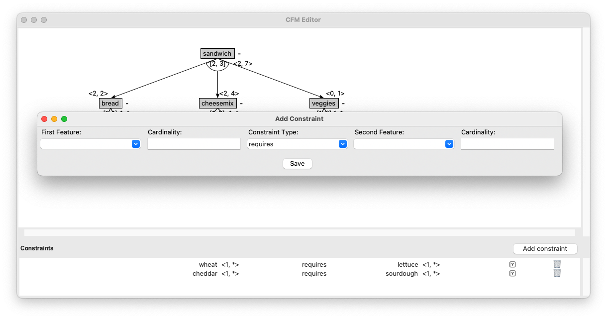

To add a new feature to your feature model in the CFM Toolbox Editor, follow these steps:

**1. Right-Click on the Feature**

Locate the feature in the editor where you want to add a constraint.
**Right-click** on the feature to open the context menu.


**2. Select "Add Constraint" from the Menu**

From the context menu, select the option "Add Constraint". This will open the constraint creation dialog.

**3. Define the Constraint**

In the dialog, provide the following details:
1. First Feature: Select the first feature involved in the constraint.
2. Cardinality for First Feature: Specify the cardinality for the first feature (e.g., 1..1, 0..*, etc.).
3. Constraint Type: Choose the type of constraint (e.g., requires, excludes, etc.).
4. Second Feature: Select the second feature involved in the constraint.
5. Cardinality for Second Feature: Specify the cardinality for the second feature.
Click "Add" or "Apply" to confirm and create the     constraint.



# Notes

**Constraint Types:**

- **Requires:** If the first feature is selected, the second feature must also be selected.
- **Excludes:** If the first feature is selected, the second feature cannot be selected, and vice versa.

**Cardinality:** Ensure the cardinality values align with your model's requirements.

**Validation:** The editor will validate the constraint to ensure it does not conflict with existing constraints or feature relationships.

# Constraint Panel

You can view and manage all constraints in the **Constraints Panel** of the editor. This panel provides an overview of all constraints and allows you to edit or delete them if needed.

# Example
Here’s an example of how a constraint might look in the feature model:

``` Shell
Feature A (1..1) requires Feature B (1..1)
```
