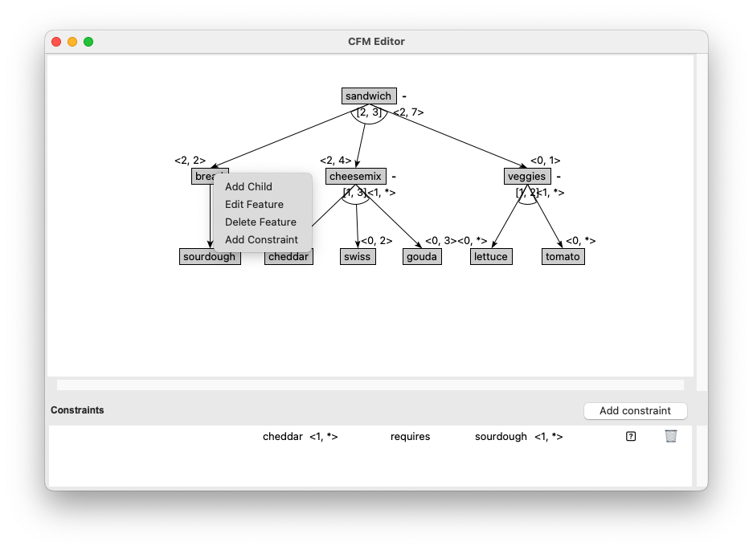
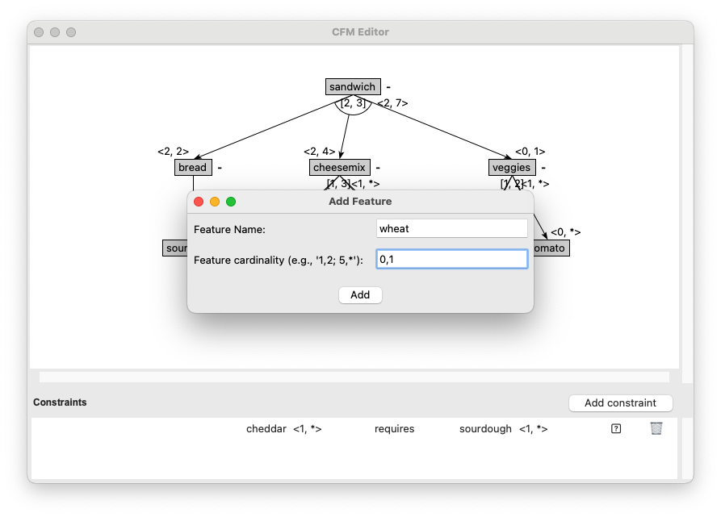

To add a new feature to your feature model in the CFM Toolbox Editor, follow these steps:

**1. Right-Click on the Feature**

Locate the feature in the editor where you want to add a child feature.
**Right-click** on the feature to open the context menu.


**2. Select "add child" from the Menu**

From the context menu, select the option "Add Child". This will open a dialog for creating a new child feature.

**3. Enter Feature Details**

In the dialog, provide the following details:

- Name: Enter a name for the new feature.
- Cardinalities: Specify the cardinality values for the feature (e.g., 1..1, 0..*, etc.).
  Click the "Add" button to confirm and create the feature.



The new feature will now appear as a child of the selected feature in the editor.
You can continue editing or adding more features as needed.

# Notes

**Cardinality:** Ensure that the cardinality values align with your feature model's requirements.

**Undo:** If you make a mistake, you can use the Undo option (Ctrl+Z or Cmd+Z) to revert the changes.

# Example

Here’s an example of how the feature tree might look after adding a new feature:

``` Shell
Root Feature
├── Feature A
│   └── New Child Feature (1..1)
└── Feature B
```
