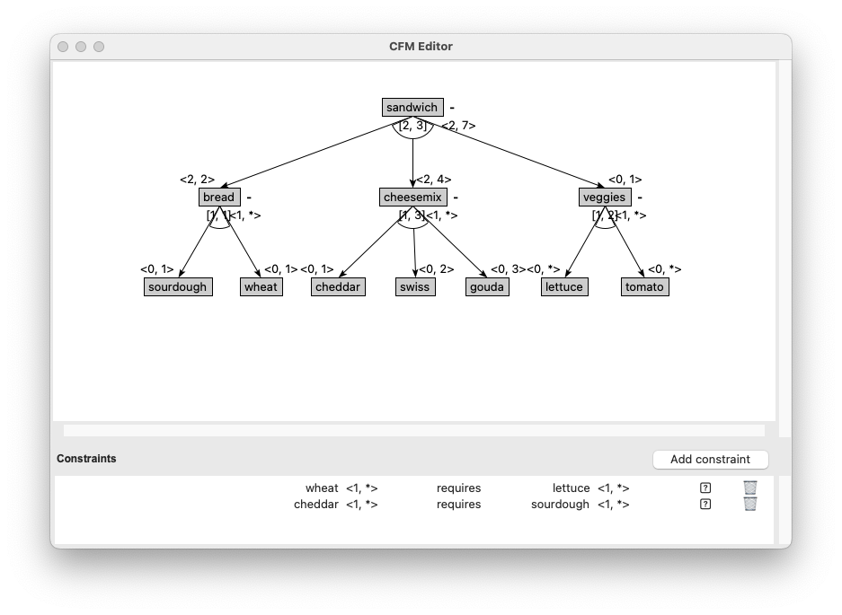
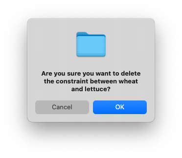

To delete a constraint from your feature model in the CFM Toolbox Editor, follow these steps:

**1. Select the Constraint in the Constraints Panel**

In the Constraints Panel in the editor, locate and select the constraint you want to delete.



**2. Click the Delete Icon**

Once the constraint is selected, click the Delete Icon (usually represented by a trash bin or cross symbol) in the Constraints Panel.

**3. Confirm Deletion**

A confirmation dialog will appear to ensure you want to delete the constraint.
Click "OK" or "Cancel" to proceed with the deletion.



# Notes

**Impact:** Deleting a constraint may affect the validity of your feature model. Ensure that the removal aligns with your model's requirements.

**Undo:** If you accidentally delete a constraint, you can use the Undo option (Ctrl+Z or Cmd+Z) to restore it.

# Example
Here’s an example of how the Constraints Panel might look before and after deleting a constraint:

**Before**

``` Shell
Constraints:
1. Feature A (1..1) requires Feature B (1..1)
2. Feature C (0..*) excludes Feature D (1..1)
```

**After Deleting the First Constraint:**
``` Shell
Constraints:
1. Feature C (0..*) excludes Feature D (1..1)
```