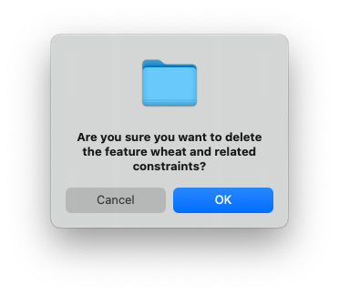

To delete a feature from your feature model in the CFM Toolbox Editor, follow these steps:

**1. Right-Click on the Feature**

Locate the feature in the editor that you want to delete.
**Right-click** on the feature to open the context menu.


**2. Select "Delete Feature" from the Menu**

From the context menu, select the option "Delete Feature". This will open a confirmation dialog.

**3. Confirm Deletion**

In the confirmation dialog, review the details of the feature you are about to delete.
Click "OK" or "Cancel" to proceed with the deletion.



# Notes

**Undo:** If you accidentally delete a feature, you can use the Undo option (Ctrl+Z or Cmd+Z) to restore it.

**Impact:** Deleting a feature will also remove all its child features and any constraints associated with it. Ensure this is intended before confirming.

# Example
Here’s an example of how the feature tree might look before and after deleting a feature:

**Before**

``` Shell
Root Feature
├── Feature A
│   └── Child Feature 1
└── Feature B
```

**After Deleting "Feature A"**
``` Shell
Root Feature
└── Feature B
```