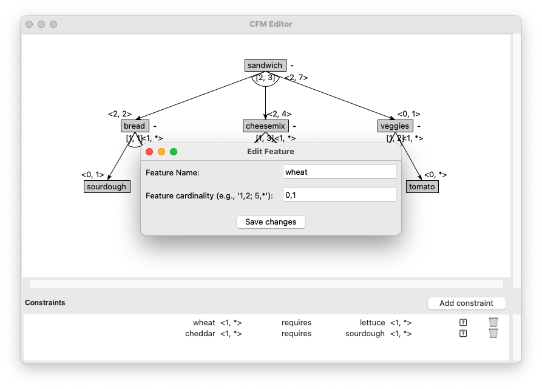

To edit a feature in your feature model using the CFM Toolbox Editor, follow these steps:

**1. Right-Click on the Feature**

Locate the feature in the editor that you want to edit.
**Right-click** on the feature to open the context menu.


**2. Select "Edit Feature" from the Menu**

From the context menu, select the option "Edit Feature". This will open the edit dialog.

**3. Modify Feature Details**

In the edit dialog, you can change the following:

- Name: Update the name of the feature. Ensure the new name is unique and does not conflict with existing feature names.
- Cardinality: Adjust the cardinality values (e.g., 1..1, 0..*, etc.) as needed.

Click "Save Changes" to confirm your changes.
In the edit dialog, you can change the following:

- Name: Update the name of the feature. Ensure the new name is unique and does not conflict with existing feature names.
- Cardinality: Adjust the cardinality values (e.g., 1..1, 0..*, etc.) as needed.
  Click "Save Changes" to confirm your changes.



# Notes

**Unique Name:** The feature name must be unique within the model. If the name already exists, you will be prompted to
choose a different name.

**Constraints Update:** If the feature is involved in any constraints (e.g., cross-tree constraints), these constraints
will be automatically updated to reflect the changes. Ensure the updated constraints still align with your model's
requirements.

**Undo:** If you make a mistake, you can use the Undo option (Ctrl+Z or Cmd+Z) to revert the changes.

# Example

Here’s an example of how the feature tree might look before and after deleting a feature:

**Before**

``` Shell
Root Feature
├── Feature A (1..1)
└── Feature B (0..*)
```

**After Editing "Feature A" to "Feature X" with Cardinality 0..1:**

``` Shell
Root Feature
├── Feature X (0..1)
└── Feature B (0..*)
```
